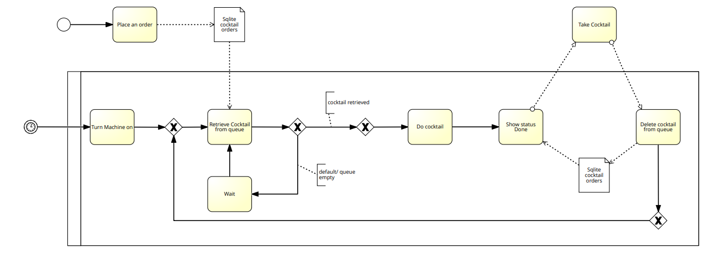

# Praktika 23SS User Interface Enea Gore

## 

### The application is hosted on the [ge72git lehre server](https://lehre.bpm.in.tum.de/~ge72git/prak_23_enea) and UI for ordering is available here:  [BASE UI](https://lehre.bpm.in.tum.de/~ge72git/prak_23_enea/frontend/wait.php)

### The process engine instance (22817) is available on this [cpee instance](https://cpee.org/flow/index.html?monitor=https://cpee.org/flow/engine/22817/)
***
## Archtiecture

***
## Initial BPMN

***
## PROCESS Engine

***

## Database and Server

The Sqlite Database has 1 table of name "orders" with following Columns:
- id STRING (chosen by user)
- uniqid STRING (generated on server)
- order STRING
- status STRING
  
The server files:

- order_queue.php (Adds a cocktail to the queue with status in_queue and a generated uniqid, the request comes from the base User interface)
- retrieve.php (Queries the database for a cocktail with status in_queue, return "None" if there isnt any)
- delete_queue.php (Delete a record from the database based on given uniqiq)
- update_status.php (Updates the status of a record in the database base on the status and uniqid passed in the Request body)
- event.php (Creates a stream of all records in the database, these are continously read from the preping user interface so the page is updated without refreshing)
***
## USER INTERFACE
### [BASE UI](https://lehre.bpm.in.tum.de/~ge72git/prak_23_enea/frontend/wait.php)
The Base UI allows you to customize any combination of drinks. To assist in the process you can choose to pick a random cocktail, order by voice assist(only cocktail names) or use the gpt3 bartender to recommend. After the order has been placed the user is takign to the Preperation UI.

***
### [Preperation UI](https://lehre.bpm.in.tum.de/~ge72git/prak_23_enea/frontend/preping.php) 
Based on the status properties that is retrieved from the SSE's the orders are sorted on the UI. Market in red are the orders made from the id the same as the user.

***
### [GPT UI](https://lehre.bpm.in.tum.de/~ge72git/prak_23_enea/frontend/my_gpt3.php)
Here you can share some preference and get a response from gpt3.5 Turbo engine. There is a pre prompt to make gpt3 aware of the context. The result is than parsed and any available ingredients are transfered to the BASE UI. Please note that the OPEN_API_KEY provided in this repository has been disabled but it is still functional on the lehre server.

***
