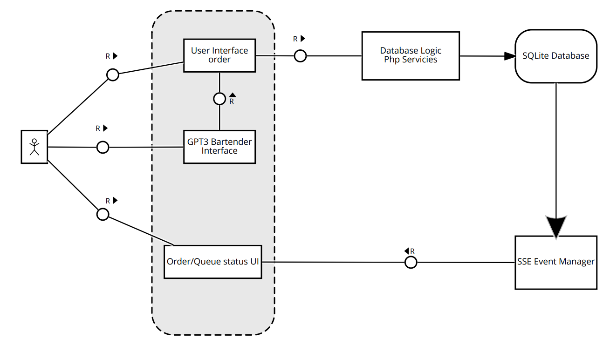
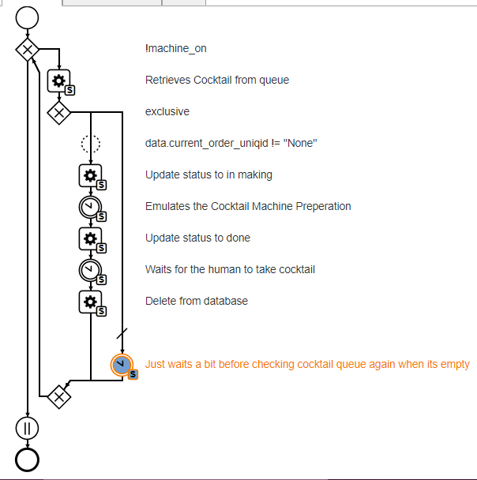
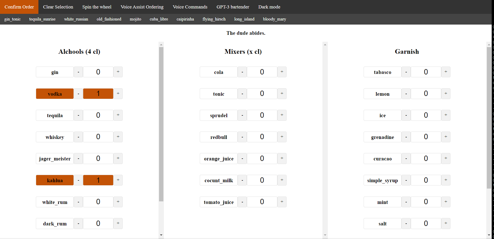
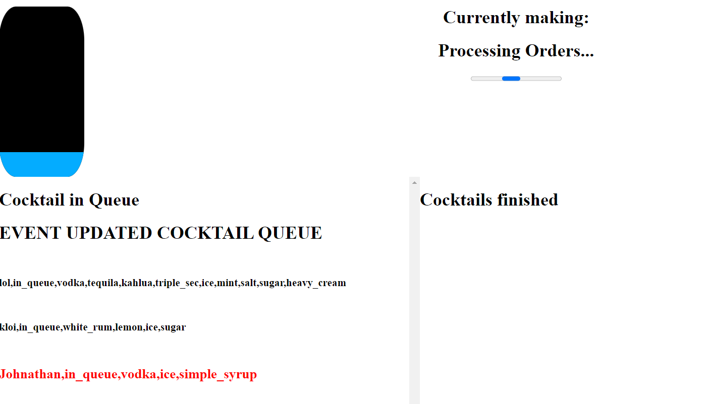
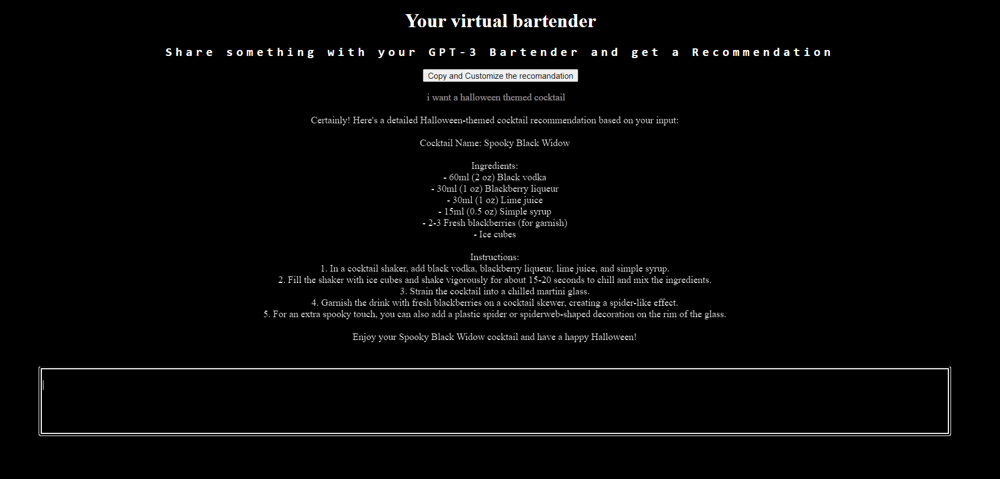

# Praktika 23SS Worker Assistance Summer User Interfac 

## 

### The application is hosted on the [ge72git lehre server](https://lehre.bpm.in.tum.de/~ge72git/prak_23_enea) and UI for ordering is available here:  [BASE UI](https://lehre.bpm.in.tum.de/~ge72git/prak_23_enea/frontend/wait.php)

### The process engine instance (22817) is available on this [cpee instance](https://cpee.org/flow/index.html?monitor=https://cpee.org/flow/engine/22817/)

## Archtiecture

## PROCESS Engine

## Database and Server

The Sqlite Database has 1 table of name "orders" with following Columns:
- id STRING (chosen by user)
- uniqid STRING (generated on server)
- order STRING
- status STRING
  
The server files:

- order_queue.php (Adds a cocktail to the queue with status in_queue and a generated uniqid, the request comes from the base User interface)
- retrieve.php (Queries the database for a cocktail with status in_queue, return "None" if there isnt any)
- delete_queue.php (Delete a record from the database based on given uniqiq)
- update_status.php (Updates the status of a record in the database base on the status and uniqid passed in the Request body)
- event.php (Creates a stream of all records in the database, these are continously read from the preping user interface so the page is updated without refreshing)

## USER INTERFACE

***
